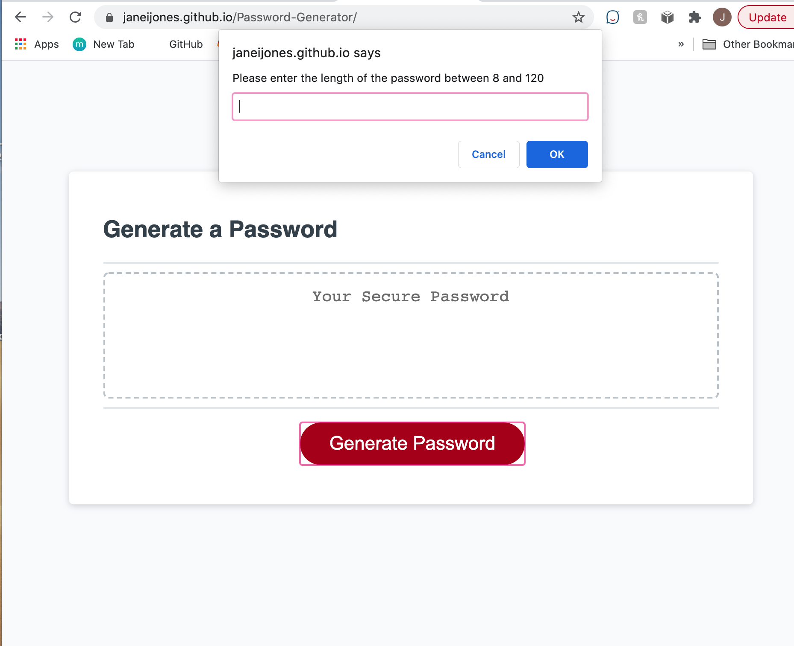
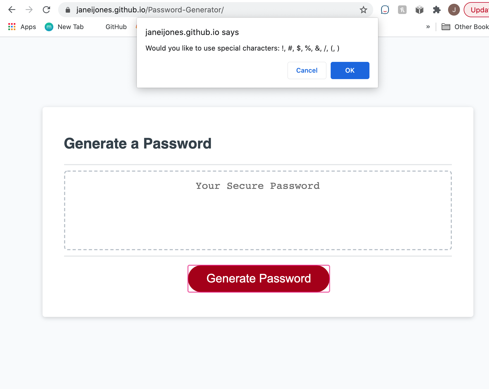
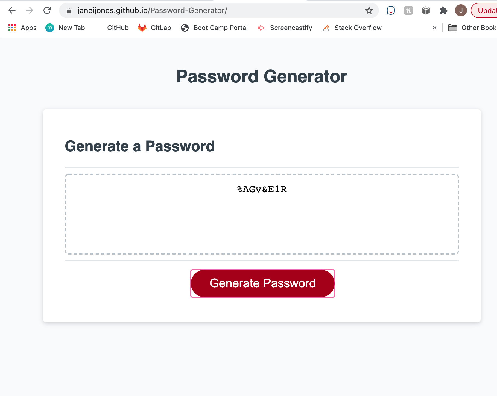

# Password Generator

## Installation
Link to hosted website:
https://janeijones.github.io/Password-Generator/

Link to access the github repository:
https://github.com/janeijones/Password-Generator

# Usage

The password generator is used to generate a random password based on specific criteria inputted by the user. 
The generate password button is selected, criteria is inputted from the user. 
Invalid input not allowed
 - password length must be between 8 and 128 characters
 - atleast 1 criteria for password generation should be selected.

 The user is prompted for length password after selecting generate button:

 

 The user inputs criteria: 
 

 Password in generated based on criteria:
 
 
 # Tests

Tests ran for invalid data:
 - Input password length less than 8 or more than 128 characters
 - Input null for password length
 - Different criteria selected for password 

 # Credits

MDN Mozilla: 
[Concat strings]
 https://developer.mozilla.org/en-US/docs/Web/JavaScript/Reference/Global_Objects/String/concat

[Use of math function]
 https://developer.mozilla.org/en-US/docs/Web/JavaScript/Reference/Global_Objects/Math/random

